# Instalación de UCUnix en una virtual machine
Cosas necesarias:
- Una VM (ejemplo: QEMU, VirtualBox)
- La ISO de UCUnix
## Procedimiento
### Instalación de la VM
En esta guía usaremos VirtualBox, pero se puede hacer con cualquier otra máquina virtual.
Este es el [enlace de instalación](https://www.virtualbox.org/wiki/Downloads) de VirtualBox.
### Instalación de la ISO
Hay que ir al directorio de [UCUnix](https://github.com/s-blanco-dev/UCUnix) e ir a la sesión de [releases](https://github.com/s-blanco-dev/UCUnix/releases), allí encontraremos la imagen ISO para descargar.

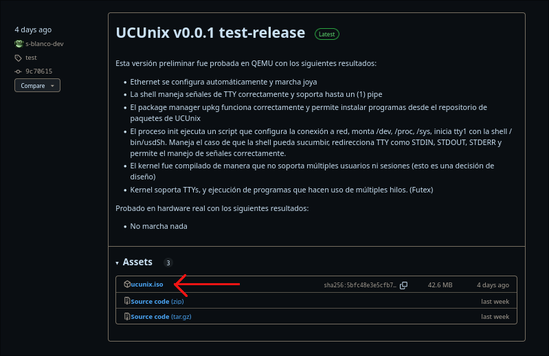

Acá podemos ver una indicación de la ISO de la versión 0.0.1.
### Creación de la máquina virtual
Esta parte será indicada en VirtualBox, pero deberá funcionar similar en otras máquinas virtuales.
* Abrimos VirtualBox
* Elegimos la opción de "Nueva"/"New" como se ve en la imagen

  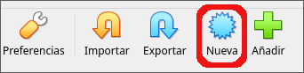

* Ahora nos saldrá un menú como este, en esta sección indicamos el nombre de la máquina, la ubicación de la máquina, la ubicación de nuestra ISO,  el tipo (Linux) y su subtipo (Other Linux) 

  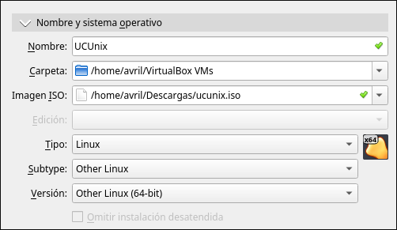

* Esta sección habla sobre cuanta memoria RAM y núcleos de nuestro procesador queremos que utilice nuestra máquina virtual _(una máquina virtual usa los recursos de la máquina anfitriona, es decir en donde instalamos VirtualBox)_, con un núcleo y 512mb debería ir bien para ejecutar UCUnix, es recomendable seleccionar lo que se encuentra en el nivel verde para no darle recursos de más a nuestra máquina virtual.

  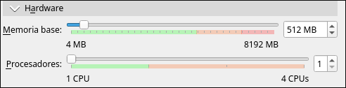

* Y por último, la selección del tamaño del disco virtual. UCUnix **no precisa** un disco duro virtual, ya que corre en la memoria RAM. Lo recomendable es seleccionar la opción de no usar un disco virtual. O ponerle algunos gigas como se ve en la imágen.

  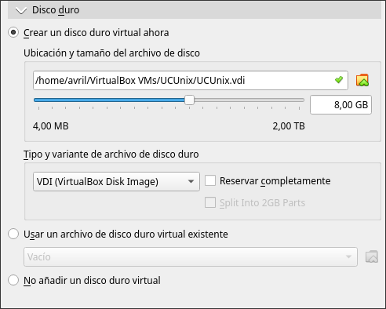

* Ya estaríamos con las opciones de iniciación de la máquina virtual.
### Opciones adicionales para el buen funcionamiento
En esta sección se mostrarán algunas opciones adicionales para que funcione bien la máquina virtual y no cause ningún conveniente. Todas estas opciones se pueden encontrar en el apartado de "configuración" de VirtualBox
* Opciones del sistema, como habilitar el reloj del hardware.

  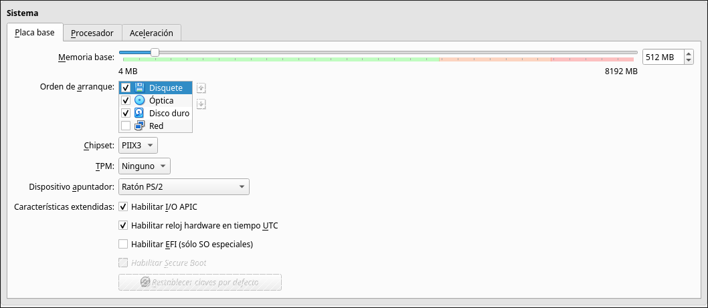

* Opciones de la pantalla, es importante agregar al menos cierta cantidad a la memoria de vídeo, para no tener problemas

  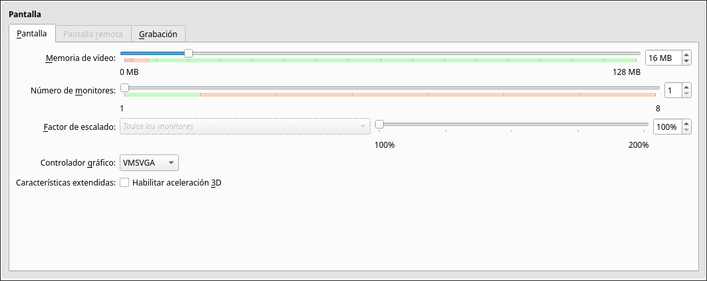

* Opción de Internet, es **importante** seleccionar "Intel PRO....." ya que UCUnix solo funciona con pocos adaptadores, siendo el Intel PRO.... uno de los pocos adaptadores que funciona en UCUnix.

  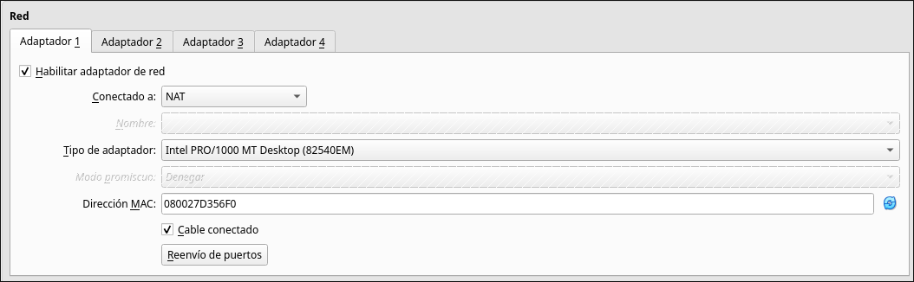

## Verificación de la instalación
Cuando abramos la máquina virtual encontraremos el GRUB, con la opción de UCUnix. Seleccionamos esta opción o se seleccionará automáticamente en cinco segundos.

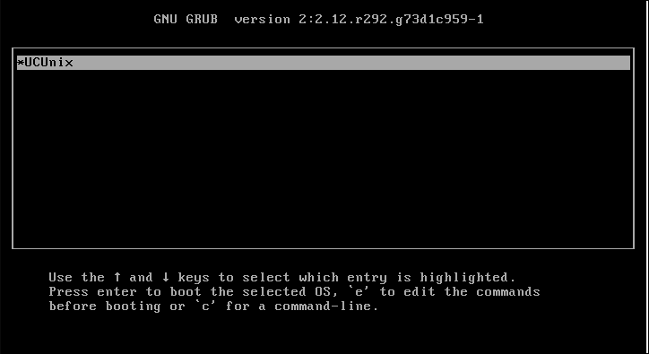

Y la pantalla de inicio se vería así

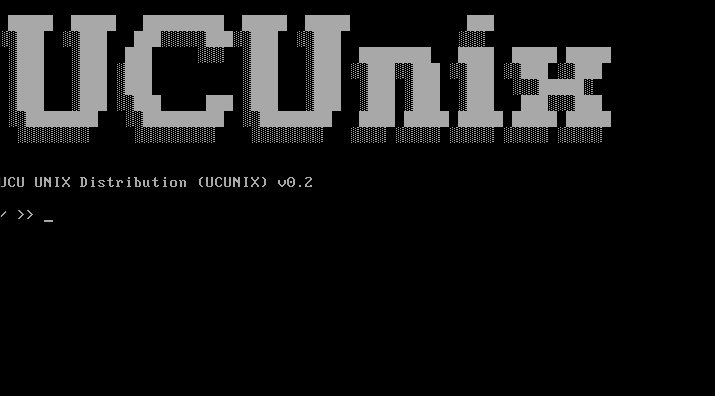

Para probar el Internet, probaremos instalar ucufetch del upkg de UCUnix.

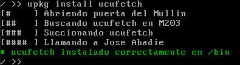

Prueba del funcionamiento de UCUfetch

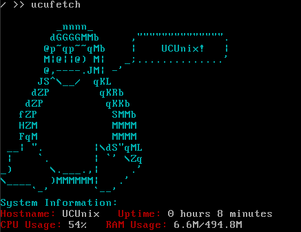
